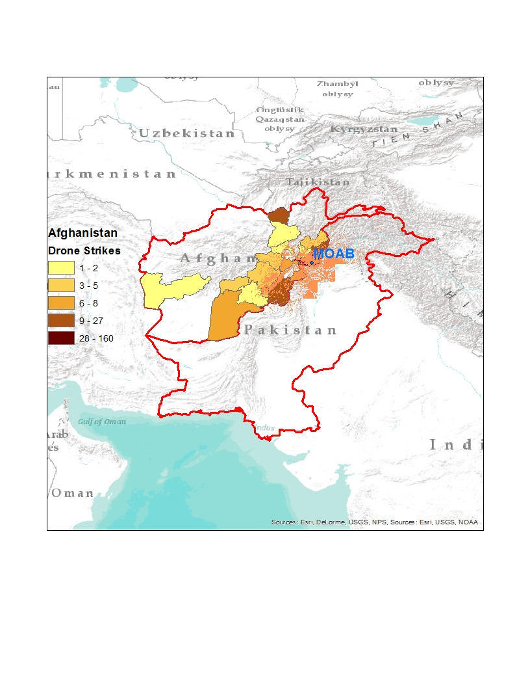

# Mother-of-all-Bombs
How big was the "Mother of All Bombs" dropped on April 13, 2017 in Afghanistan?

By creating a "Viewshed" map in ArcGIS, we can get a visual sense of the answer.

First of all, here is the location on a map of where the bomb was dropped:

Vox reported that the MOAB reportedly has a blast radius that "goes up to a mile"(https://www.vox.com/world/2017/4/13/15292418/moab-mother-of-all-bombs), and MSN noted the actual bomb used resulsted in a "plume of smoke that rose more than 10,000 feet in the air" (http://www.msn.com/en-us/news/world/everything-you-need-to-know-about-the-mother-of-all-bombs/ar-BBzOwFT). Using these measures, we can use the viewshed tool in ArcMap to visualize where the smoke was visible, factoring in the country's mountainous terrain:

Let's zoom in a bit:

For fun, let's compare this to a visualization of drone strikes by province in Afghanistan:

